# Neural Style Transfer (PyTorch)

Paper Reference: https://arxiv.org/pdf/1508.06576.pdf

  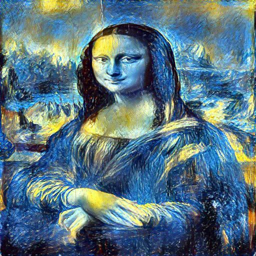
  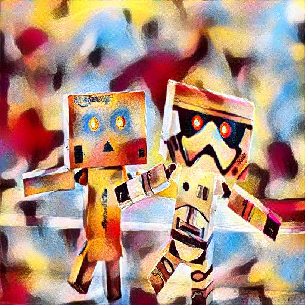 
  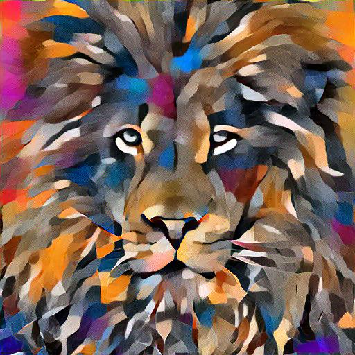

Configuration used:                                                             
- Optimizer Used: L-BFGS
- Content Layer = 'Conv_5'
- Style Layer = 'Conv_1', 'Conv_2', 'Conv_3', 'Conv_4', 'Conv_5'
- CNN = VGG-19 (Pre-trained)
- GPU = Nvidia 1080Ti

# Examples:
|  Style Image | Content Image  |  CW |  SW |  NST Image |
|---|---|---|---|---|
|||   1|   1000000|   |
|||   1|   1000000|  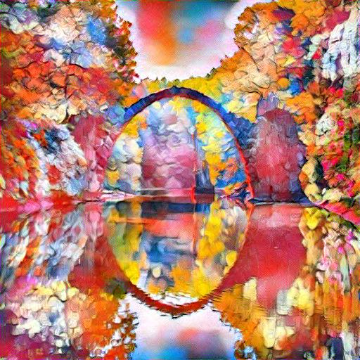 |
|||   10|   100000|  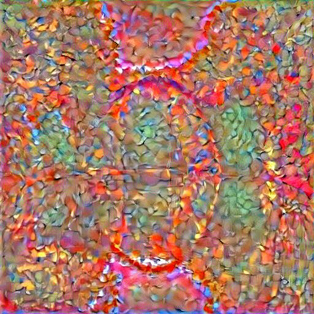 |
|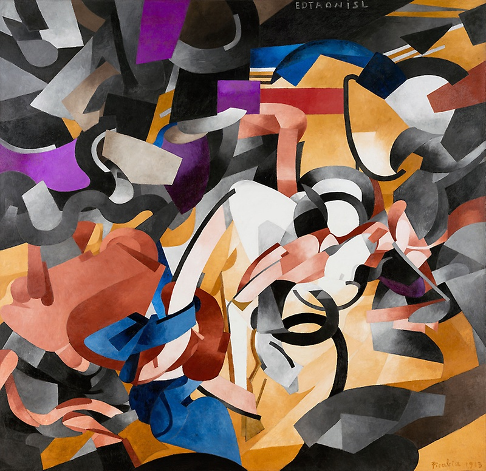||   1|   1000000|  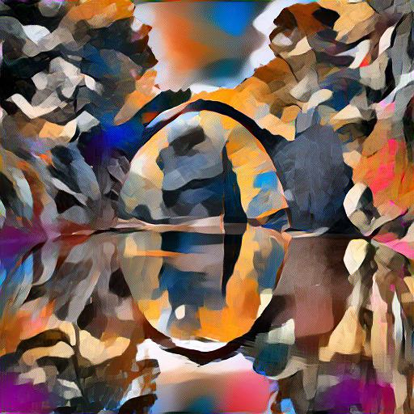 |
||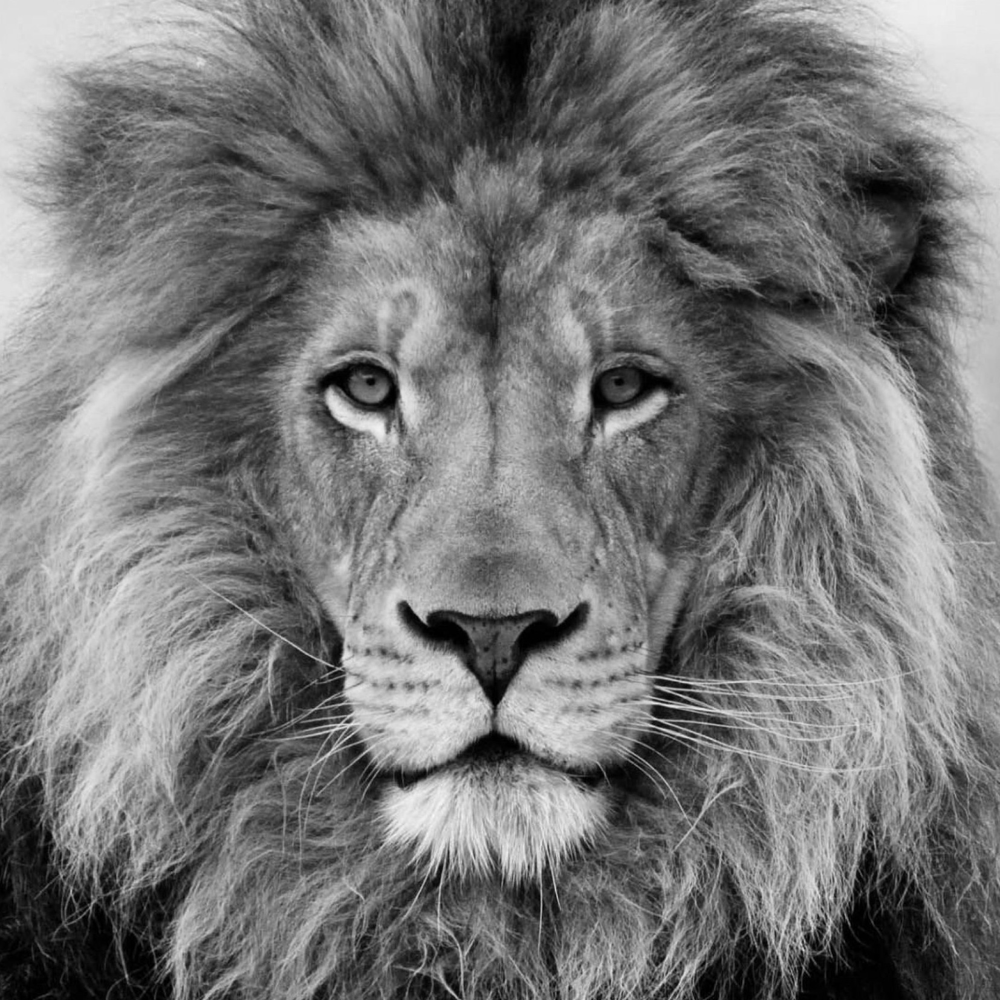|   1|   1000000|   |

# NST sequence example

The below snapshot is the various stages of NST specifically at a gap of 100 iterations of the LBFGS optimizer from 0 to number of steps.

Eg 1:
 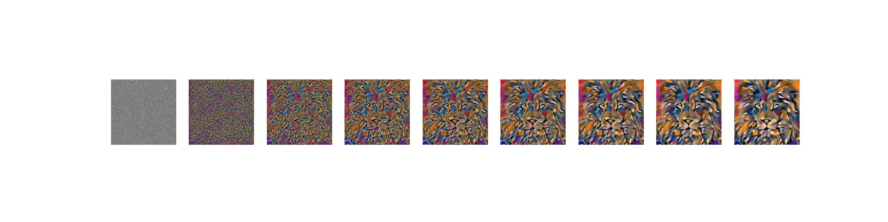

Eg 2:
  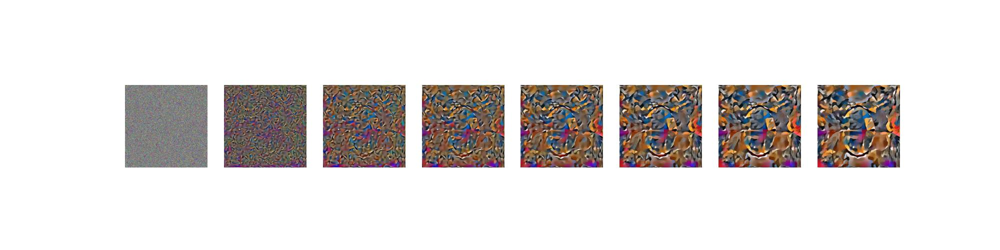

Eg 3:
    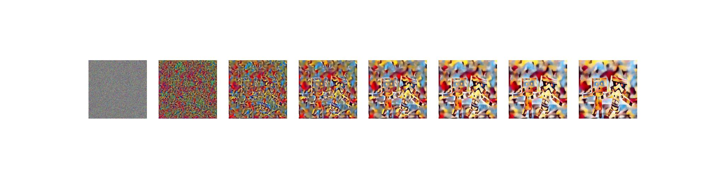

# How to run this ?

Note above samples are on Nvidia 1080Ti GPU and use L-BFGS optimizer. To use L-BFGS need a GPU machine with CUDA installed. For torch.cuda.is_available() is false use Adam optimizer instead

If starting from noise_img otherwise give the starting image as input.

1. Create a virtual Environment
  `conda create -n env`
2. Activate the environment
  `conda activate env`
3. Install Pytorch
  `conda install pytorch torchvision torchaudio pytorch-cuda=11.8 -c pytorch -c nvidia`
4. Run
 `python main.py --style 'edtaonisl.jpg' --content 'green_bridge.jpeg' --input "noise" --style_weight 1000000 --content_weight 1 --num_steps 500`
5. To Run using Gradio
   `python gradio_nst`
