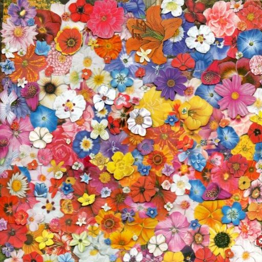
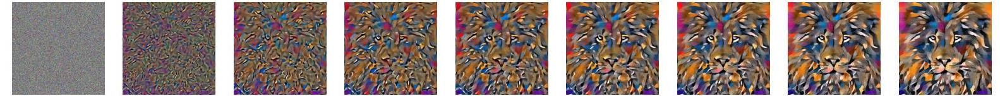
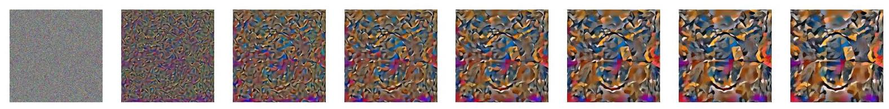

# Neural Style Transfer

Paper Reference: https://arxiv.org/pdf/1508.06576.pdf

Configuration used:
- Optimizer Used: L-BFGS
- Content Layer = 'Conv_5'
- Style Layer = Conv_1, Conv_2, Conv_3, Conv_4, Conv_5
- CNN = VGG 19 (Pre-trained)

# Examples:
|  Style Image | Content Image  |  CW |  SW |  NST Image |
|---|---|---|---|---|
|||   1|   1000000|   |
|||   10|   100000|   |
|||   1|   1000000|   |
|||   1|   1000000|   |

# NST sequence example

The below snapshot is the various stages of NST specifically at a gap of 100 iterations of the LBFGS optimizer from 0 to number of steps.

Eg 1:
 

Eg 2:
  


# How to run this ?

Note above samples are on Nvidia 1080Ti GPU and use L-BFGS optimizer. To use L-BFGS need a GPU machine with CUDA installed. For torch.cuda.is_available() is false use Adam optimizer instead

If starting from noise_img otherwise give the starting image as input.

```
python main.py --style 'edtaonisl.jpg' --content 'green_bridge.jpeg' --input "noise" --style_weight 1000000 --content_weight 1 --num_steps 500

```
